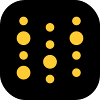

# Hi there! Welcome to my GitHub Profile 🤗

## 🤵 About me

My name is Jens Rahnfeld and i am currently enrolled in a Master of Science, Computer Science program at the Albert Ludwigs University of Freiburg. I'm a Deep Learning enthusiast, especially excited when it comes to applications in the field of Computer Vision. Projects shine the most, when you can actually see and interact with something. Thus, i also picked up web development skills for showcasing my work & creating awesome apps.

:book: 2016-2021 **Bachelor of Science, Computer Science**. This is where my journey as computer scientist started. After a broad introduction to various fields i discovered deep learning and particularly computer vision for myself. In my thesis, i worked on action-conditioned video prediction with 3D images.

:book: 2018-2022 **Bachelor of Science, Mathematics**. Always trying to understand the underlying concepts i realized my lack of math skills. So i decided to polish them through a math degree with focus on statistics. In my thesis, i worked on non-parametric maximum likelihood estimation for type 1 censored data.

## :muscle: Technical Skills

💻 Programming Languages

  
  
  
  
  

🔧 Frameworks & Tools

  
  
  
  
  
  

<!--
**JensRahnfeld/JensRahnfeld** is a ✨ _special_ ✨ repository because its `README.md` (this file) appears on your GitHub profile.

Here are some ideas to get you started:

- 🔭 I’m currently working on ...
- 🌱 I’m currently learning ...
- 👯 I’m looking to collaborate on ...
- 🤔 I’m looking for help with ...
- 💬 Ask me about ...
- 📫 How to reach me: ...
- 😄 Pronouns: ...
- ⚡ Fun fact: ...
-->
